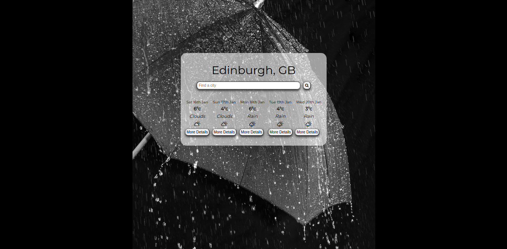
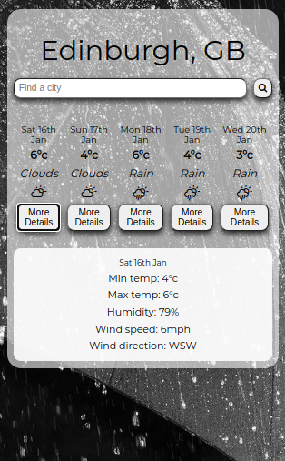

# React Weather App

This project was built with [Create React App](https://github.com/facebook/create-react-app).\
\
This is a simple weather app which gets and displays a 5-day forecast. The default location is Edinburgh but can be changed by searching for another town or city in the UK.\
\
Click the 'More Details' button to show or hide additional weather info for a selected day.

 
### Browser view:

### Mobile view, with detail panel:

## View app online

[Click here](https://samtovey13.github.io/weather-app/) to view the live app, deployed to github-pages.

## Run app locally

To run the app locally in development mode, clone this repo and run:

#### `npm start`

Runs the app in the development mode and opens [http://localhost:3000](http://localhost:3000) to view it in the browser.
\
The page will reload if you make edits and errors will show in the console.

#### `npm test`

Launches the test runner in the interactive watch mode. See further info on [running tests in React](https://facebook.github.io/create-react-app/docs/running-tests).

## API Data

The app uses the [Manchester Codes Weather API](https://mcr-codes-weather.herokuapp.com/), which is in turn based on the open-source project [OpenWeatherMap API](https://openweathermap.org/api).